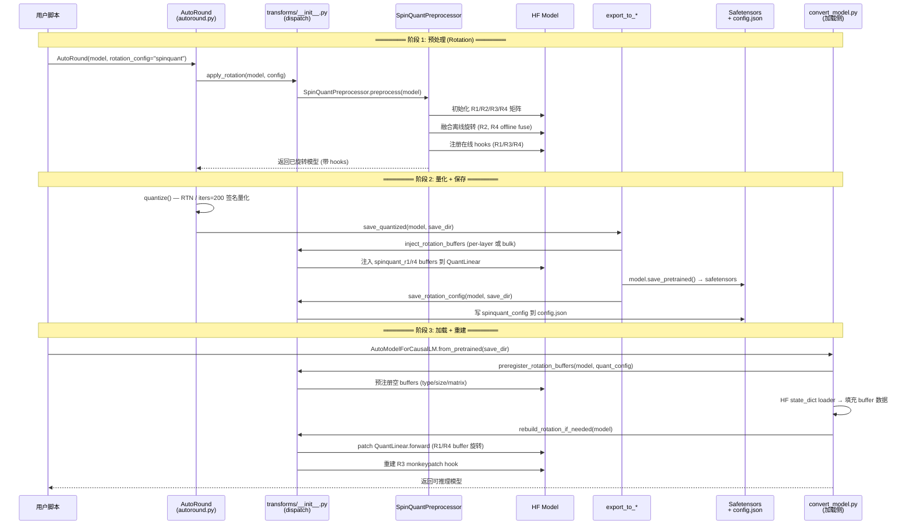
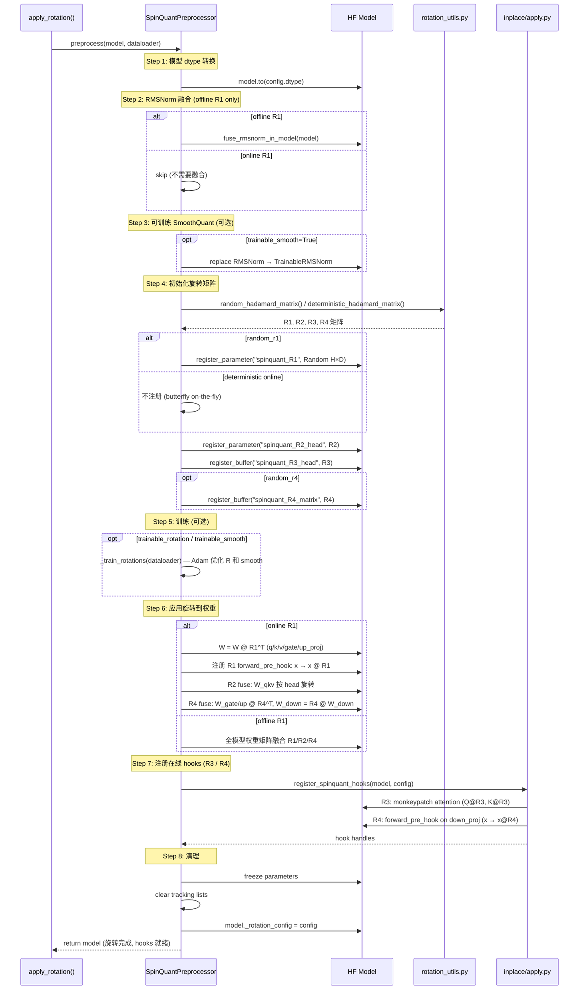
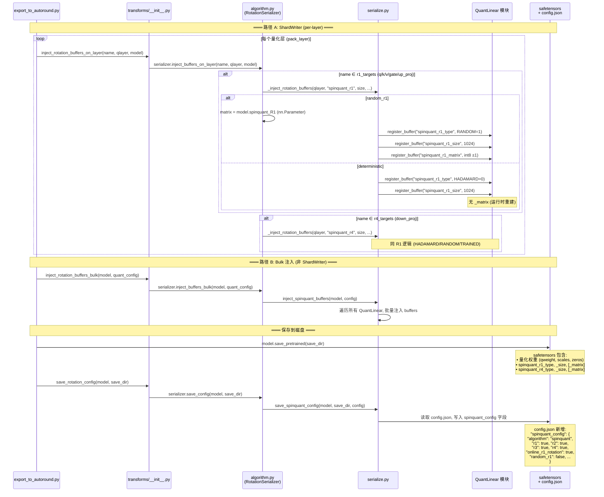
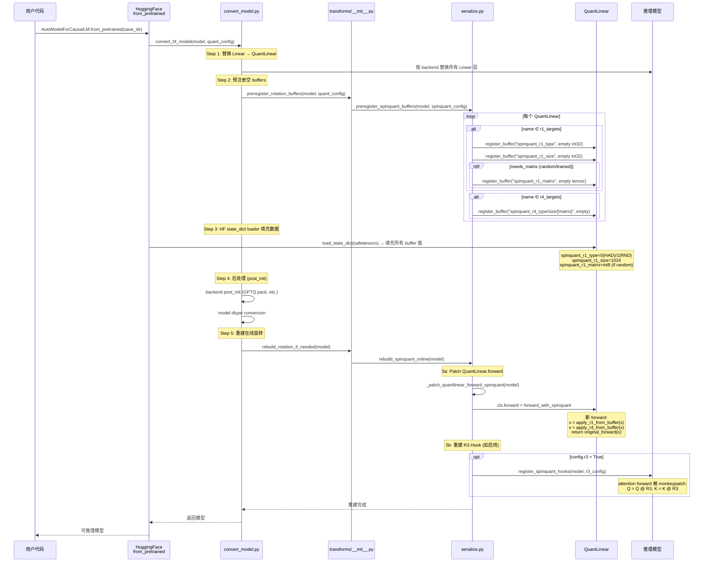
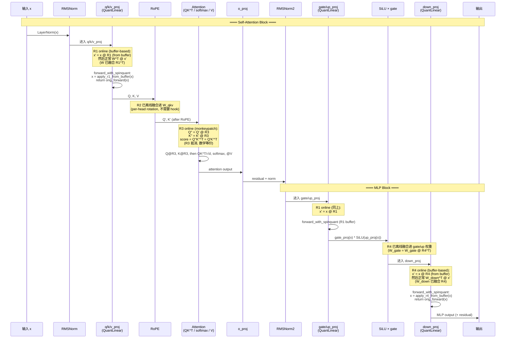

# SpinQuant/QuaRot 时序图

本文档以 Mermaid 时序图描述 rotation + quantization 的完整流程，分为三大阶段：

1. **预处理阶段**（Rotation 应用 + 量化前准备）
2. **保存阶段**（量化后模型序列化）
3. **加载阶段**（反序列化 + 在线旋转重建）

---

## 图 1: 总览 — 三阶段全流程



---

## 图 2: 预处理阶段详细流程

展示 `SpinQuantPreprocessor.preprocess()` 的 8 个步骤：



---

## 图 3: 保存阶段详细流程

展示量化模型如何序列化 rotation buffers：



---

## 图 4: 加载阶段详细流程

展示从磁盘恢复完整推理能力：



---

## 图 5: 推理时前向传播 — 旋转作用路径

展示单个 Transformer Layer 中，旋转在前向传播中的作用位置：



---

## 图 6: Buffer 存储类型决策树

```mermaid
flowchart TD
    A[_inject_rotation_buffers<br/>prefix, size, random, is_trained, rotation_matrix] --> B{is_trained?}
    B -->|Yes| C[rot_type = TRAINED<br/>存 float32 完整矩阵]
    B -->|No| D{random?}
    D -->|Yes| E[rot_type = RANDOM<br/>存 int8 ±1 矩阵]
    D -->|No| F[rot_type = HADAMARD<br/>仅存 type + size<br/>运行时用 butterfly 重建]

    C --> G[buffers 注册到 QuantLinear]
    E --> G
    F --> G

    G --> H{加载时: rot_type?}
    H -->|HADAMARD=0| I[get_hadamard_K(size)<br/>matmul_hadU butterfly<br/>O(n log n)]
    H -->|RANDOM=1| J[matrix.float() / √n<br/>dense matmul x @ R<br/>O(n²)]
    H -->|TRAINED=2| K[matrix (float32)<br/>dense matmul x @ R<br/>O(n²)]
```

---

## 图 7: R1/R2/R3/R4 各自的作用方式总结

| Rotation | 应用方式 | 何时执行 | 是否需要存矩阵 |
|----------|---------|---------|---------------|
| **R1 offline** | 权重融合 `W = R1 @ W @ R1^T` | 预处理时 | ❌ 不需要 |
| **R1 online** | 权重半融合 `W = W @ R1^T` + hook `x' = x @ R1` | 预处理 + 推理时 | ✅ random/trained 需要 |
| **R2** | 权重融合 per-head `W_qkv[:, h] = W @ R2` | 预处理时 | ❌ 已融合 |
| **R3** | Attention monkeypatch `Q@R3, K@R3` | 推理时 | ❌ 任何正交 R 都等价 |
| **R4 offline** | 权重融合 `W_gate/up @ R4^T`, `R4 @ W_down` | 预处理时 | — |
| **R4 online** | hook `x' = x @ R4` on down_proj | 推理时 | ✅ random/trained 需要 |

**关键公式**：
- R1: `x @ R1 @ (W @ R1^T)^T = x @ R1 @ R1 @ W^T = x @ W^T` ✓ 数学等价
- R3: `(Q@R3)(K@R3)^T = Q@R3@R3^T@K^T = Q@K^T` ✓ 正交矩阵抵消
- R4: `(activation @ R4) @ (R4^T @ W_down^T) = activation @ W_down^T` ✓ 等价

---

## 附录: 文件职责映射

```
auto_round/
├── autoround.py                          # 入口: AutoRound 主类
├── algorithms/transforms/
│   ├── __init__.py                       # 调度层: apply_rotation, inject, save, preregister, rebuild
│   └── spinquant/
│       ├── preprocessor.py               # 预处理: 矩阵创建、权重旋转、hook 注册
│       ├── serialize.py                  # 序列化: buffer 注入、config 保存、加载重建
│       ├── algorithm.py                  # RotationSerializer mixin 实现
│       ├── inplace/
│       │   ├── apply.py                  # register_spinquant_hooks (R3/R4 hook 注册)
│       │   ├── r3_monkeypatch.py         # R3 attention monkeypatch 实现
│       │   └── rotation_utils.py         # matmul_hadU, Hadamard 分解
│       └── SERIALIZATION_ARCHITECTURE.md # 架构文档
└── inference/
    └── convert_model.py                  # 加载侧: preregister + rebuild 调用点
```
